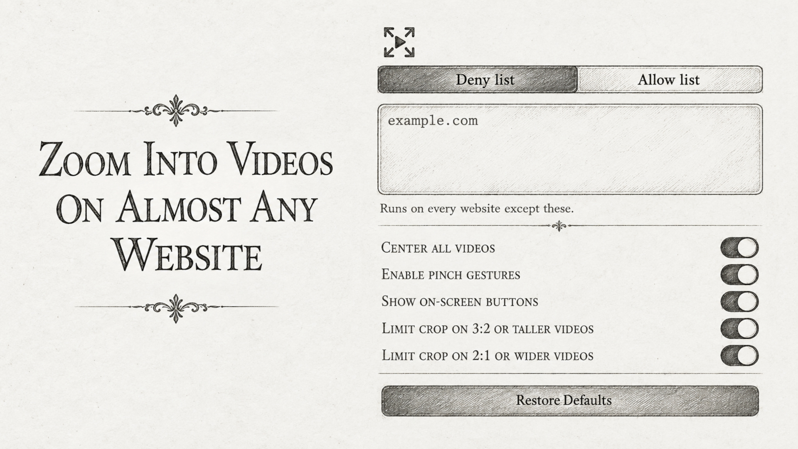

# Fill Screen Anywhere 

  
  

---

A browser extension that allows you to zoom into videos across numerous streaming platforms.

## Browser compatibility
Works on Firefox and Chromium (see [releases](https://github.com/FaridZelli/FillScreenAnywhere/releases/latest) for XPI/CRX files).

> [!NOTE]
> On hardened browsers, enable the "Allow for all sites" permission after installation.

## Mobile usage
- Pinch in and out on your screen anywhere
- Long press the full screen button on YouTube

## Desktop usage
- Fill Screen: `Ctrl+Alt+F`
- Remove Letterboxing: `Ctrl+Alt+L`
> See [Manage extension shortcuts in Firefox](https://support.mozilla.org/en-US/kb/manage-extension-shortcuts-firefox) for more info.

## Features
- Website allow/deny list
- Center all videos (mainly for Chromium-based mobile browsers)
- Limit crop ratio for ultra-wide or standard content
- Remove 16:9 letterboxing from 21:9 content
- Play videos in the background
- And much more...

---

<picture>
  <source media="(max-width: 768px)" srcset="github-content/preview-mobile.jpg">
  
</picture>

<picture>
  <source media="(min-width: 769px)" srcset="github-content/preview-desktop.jpg">
  
</picture>

## Special thanks
  
[Tabler Icons](https://github.com/tabler/tabler-icons)
